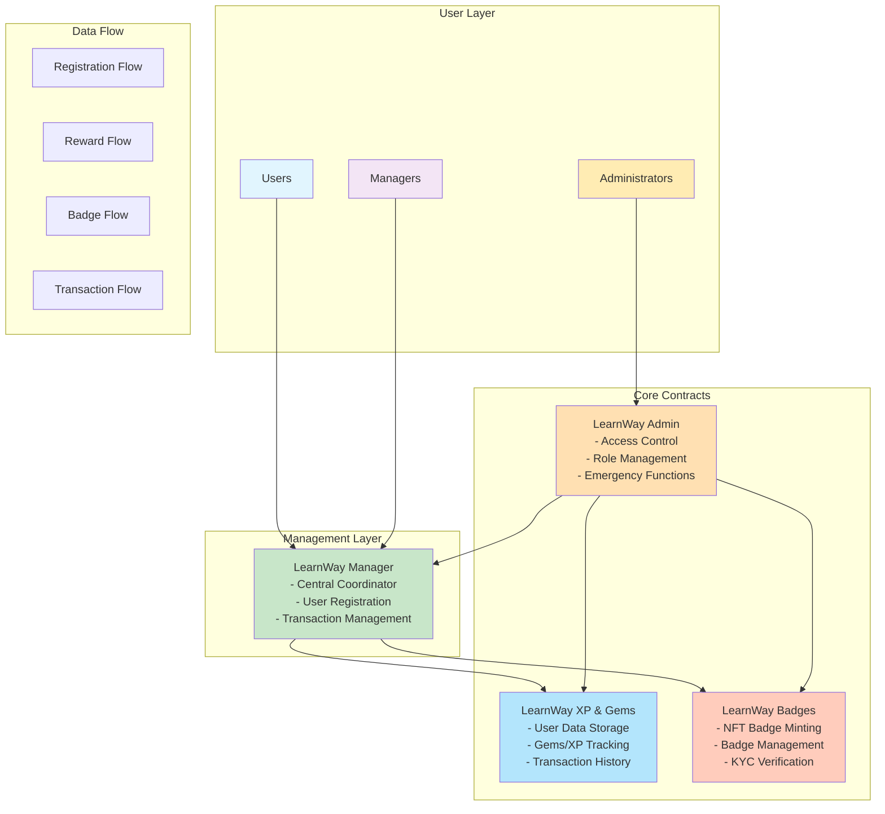
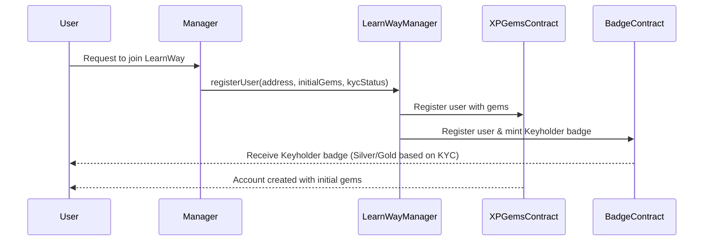
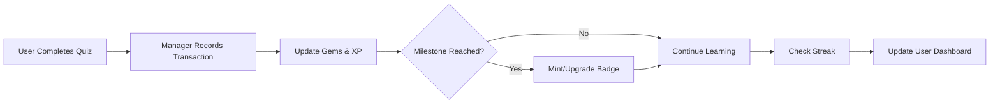

# LearnWay Smart Contract System Documentation

## Table of Contents

1. [Executive Summary](#executive-summary)
2. [System Overview](#system-overview)
3. [Architecture Diagram](#architecture-diagram)
4. [Contract Components](#contract-components)
5. [Key Features](#key-features)
6. [User Journey](#user-journey)
7. [Technical Architecture](#technical-architecture)
8. [Smart Contract Details](#smart-contract-details)
9. [Security Features](#security-features)
10. [Administrator Guide](#administrator-guide)

11. [Glossary](#glossary)

---

## Executive Summary

LearnWay is a blockchain-based educational platform that gamifies learning through a sophisticated reward system. Users earn experience points (XP), digital gems, and achievement badges as they complete educational activities like quizzes, maintain learning streaks, and participate in educational battles and contests.

### What Makes LearnWay Special?

- **Permanent Achievement Records**: All achievements are stored on the blockchain, making them tamper-proof and permanent
- **Non-Transferable Badges**: Achievement badges are "soulbound" - they cannot be sold or transferred, ensuring authentic accomplishments
- **Transparent Reward System**: All rewards and transactions are publicly verifiable on the blockchain
- **Upgradeable Infrastructure**: The system can be improved and updated without losing existing data

---

## System Overview

### For Non-Technical Users

Imagine LearnWay as a digital school where:

- **Gems** are like coins you earn for completing activities
- **XP (Experience Points)** track your overall learning progress
- **Badges** are permanent digital certificates of your achievements
- **Streaks** reward consistent daily learning
- Everything is recorded permanently and transparently

### For Technical Users

LearnWay is a suite of upgradeable smart contracts deployed on EVM-compatible blockchains that:

- Implements UUPS (Universal Upgradeable Proxy Standard) pattern
- Uses role-based access control for administrative functions
- Stores user progression data on-chain
- Mints non-transferable NFT badges as achievement certificates
- Provides comprehensive batch operations for efficient gas usage

---

## Architecture Diagram



---

## Contract Components

### 1. LearnWay Admin Contract

**Purpose**: Central authority and access control

**Key Responsibilities**:

- Manages who can perform administrative actions
- Defines four key roles:
  - **ADMIN_ROLE**: Full system control
  - **MANAGER_ROLE**: Day-to-day operations
  - **PAUSER_ROLE**: Emergency pause capability
  - **EMERGENCY_ROLE**: Critical intervention access

### 2. LearnWay XP & Gems Contract

**Purpose**: User data and reward management

**Key Features**:

- Stores user gems, XP, and streak information
- Records all learning transactions
- Tracks eight transaction types:
  - Lessons completed
  - Quizzes taken
  - User registrations
  - KYC verifications
  - Battle participations
  - Contest entries
  - Gem transfers
  - Gem deposits

### 3. LearnWay Badge Contract

**Purpose**: Achievement certification through NFTs

**Key Features**:

- Issues 24 different badge types
- Badges are non-transferable (soulbound)
- Five tier levels: Bronze, Silver, Gold, Platinum, Diamond
- Dynamic badges can be upgraded
- Special "Early Bird" badge for first 1000 KYC-verified users

### 4. LearnWay Manager Contract

**Purpose**: Orchestrates interactions between all contracts

**Key Features**:

- Single entry point for most operations
- Coordinates user registration across systems
- Manages batch operations for efficiency
- Provides unified data retrieval

---

## Key Features

### For Learners

#### 1. Progressive Achievement System

```
New User → Complete First Quiz → Earn "First Spark" Badge
         → Daily Login → Build Streak → Earn "Daily Claims" Badge
         → Complete 50 Quizzes → Upgrade to "Quiz Explorer" Gold
```

#### 2. Transparent Reward Tracking

- Every gem earned is recorded with timestamp and reason
- XP accumulation shows learning progress
- Streak counter motivates daily engagement

#### 3. Permanent Credentials

- Badges earned are permanent blockchain records
- Cannot be faked, deleted, or transferred
- Verifiable by anyone, anywhere

### For Administrators

#### 1. Flexible Management

- Batch operations for processing multiple users
- Role-based permissions for team management
- Emergency pause functionality for security

#### 2. Comprehensive Monitoring

- Track total users and registrations
- Monitor transaction volumes by type
- View detailed user histories

#### 3. Upgradeable Infrastructure

- Smart contracts can be updated without data loss
- New features can be added over time
- Bug fixes don't require system restart

---

## User Journey

### New User Registration Flow



### Learning Activity Flow



---

## Technical Architecture

### Smart Contract Design Patterns

#### 1. UUPS Proxy Pattern

All main contracts use the Universal Upgradeable Proxy Standard:

- Separates logic from storage
- Allows contract upgrades without data migration
- Reduces deployment costs

#### 2. Access Control Pattern

Hierarchical role-based permissions:

```
ADMIN_ROLE (Top Level)
    ├── Can grant/revoke all roles
    ├── Can upgrade contracts
    └── Can modify system parameters

MANAGER_ROLE
    ├── Can register users
    ├── Can record transactions
    └── Can mint badges

PAUSER_ROLE
    └── Can pause system in emergencies

EMERGENCY_ROLE
    └── Reserved for critical interventions
```

#### 3. Reentrancy Protection

All state-changing functions include reentrancy guards to prevent attacks.

### Data Structures

#### User Data Structure

```solidity
struct UserData {
    address user;           // Wallet address
    uint256 gems;          // Current gem balance
    uint256 xp;            // Total experience points
    uint256 longestStreak; // Best consecutive day streak
    uint256 createdAt;     // Registration timestamp
    uint256 lastUpdated;   // Last modification time
}
```

#### Transaction Structure

```solidity
struct Transaction {
    address walletAddress;  // User's address
    uint256 gems;          // Gems involved
    uint256 xp;            // XP gained
    uint256[] badgesList;  // Badges earned
    TransactionType txType; // Type of activity
    uint256 timestamp;     // When it occurred
    string description;    // Human-readable description
}
```

#### Badge Attributes

```solidity
struct BadgeAttributes {
    uint256 badgeId;       // Unique badge identifier
    BadgeTier tier;        // Current tier level
    uint256 mintedAt;      // When badge was earned
    uint256 lastUpdated;   // Last upgrade time
    string status;         // Current status description
}
```

---

## Smart Contract Details

### LearnWayAdmin Contract

**Key Functions**:

- `initialize()`: Sets up the contract with initial admin
- `setUpRole(role, account)`: Grants roles to addresses
- `pause()/unpause()`: Emergency system controls
- `isAuthorized(role, account)`: Checks permissions

### LearnwayXPGemsContract

**User Management Functions**:

- `registerUser(user, gems)`: Creates new user account
- `updateUserGemsXpAndStreak(user, gems, xp, streak)`: Updates user stats
- `recordTransaction(...)`: Logs user activities

**Batch Operations**:

- `batchRegisterUsers(users[], gems[])`: Register multiple users
- `batchUpdateGemsXpAndStreaks(...)`: Update multiple users
- `batchRecordTransactions(...)`: Record multiple transactions

**View Functions**:

- `getUserInfo(user)`: Complete user data
- `getUserTransactions(user)`: Transaction history
- `getUserTransactionsByType(user, type)`: Filtered transactions

### LearnWayBadge Contract

**Badge Categories**:

1. **Onboarding**: Initial platform badges
2. **Quiz Completion**: Learning milestone badges
3. **Streaks & Consistency**: Daily engagement badges
4. **Battles & Contests**: Competition badges
5. **Skill Mastery**: Advanced achievement badges
6. **Community & Sharing**: Social engagement badges
7. **Ultimate**: Elite accomplishment badges

**24 Available Badges**:
| Badge Name | Category | Dynamic | Unlock Condition |
|------------|----------|---------|------------------|
| Keyholder | Onboarding | Yes | Account setup (silver) and KYC (gold) |
| First Spark | Onboarding | No | Play Quiz for the first time |
| Early Bird | Onboarding | No | Be part of first 1000 to verify KYC |
| Quiz Explorer | Quiz Completion | Yes | Progressive quizzes |
| Master of Levels | Quiz Completion | Yes | Level achievements |
| Quiz Titan | Quiz Completion | Yes | High quiz scores |
| BRAINIAC | Quiz Completion | Yes | Perfect scores |
| Legend | Quiz Completion | Yes | Top performer |
| Daily Claims | Streaks | Yes | Claim streaks: 1-30/31-90/91-180 days |
| Routine Master | Streaks | No | Maintain 30-day streak |
| Quiz Devotee | Streaks | No | Play daily quizzes for 30 days X2 |
| Elite | Streaks | Yes | Collect 1000/3000/5000/10k Gems |
| Duel Champion | Battles | No | Win a 1v1 battle x15 |
| Squad Slayer | Battles | No | Win a group battle x12 |
| Crown Holder | Battles | No | Win a contest x3 |
| Rising Star | Skill Mastery | No | First crypto deposit |
| DeFi Voyager | Skill Mastery | Yes | Complete 3-10 transactions (send/receive/swap) |
| Savings Champion | Skill Mastery | Yes | Complete 1-10/11-30/31-50 deposits |
| Power Elite | Skill Mastery | Yes | Unlock 1-10/11-20 badges |
| Community Connector | Community | No | Invite a friend |
| Echo Spreader | Community | Yes | Share app with 1-20/21-50/51-100 people |
| Event Star | Community | No | Attend or host LearnWay events |
| Grandmaster | Ultimate | No | Max out all other badges |
| Hall of Famer | Ultimate | No | Recognized for outstanding contributions |

### LearnWayManager Contract

**Orchestration Functions**:

- `registerUser()`: Coordinates registration across contracts
- `updateUserData()`: Synchronizes user updates
- `recordTransaction()`: Manages transaction recording
- `mintBadgeForUser()`: Handles badge minting
- `getUserCompleteData()`: Aggregates all user information

---

## Security Features

### 1. Access Control

- Multi-role permission system
- Role admin hierarchies
- Function-level access checks

### 2. Reentrancy Protection

- ReentrancyGuard on all state-changing functions
- Prevents recursive call attacks

### 3. Pausable Operations

- Emergency pause capability
- Graceful system halt for security incidents

### 4. Input Validation

- Address validation (non-zero checks)
- Array length matching
- Batch size limits (max 100 operations)

### 5. Upgrade Security

- Only admin can upgrade contracts
- UUPS pattern prevents unauthorized upgrades
- Storage layout preservation

---

## Administrator Guide

### Setting Up the System

1. **Deploy Admin Contract**

   ```
   Deploy LearnWayAdmin
   → Initialize with admin address
   → Grant initial roles
   ```

2. **Deploy Core Contracts**

   ```
   Deploy XPGemsContract with admin address
   Deploy BadgeContract with admin address
   Deploy Manager with admin address
   ```

3. **Connect Contracts**
   ```
   Manager.setContracts(XPGemsAddress, BadgeAddress)
   → System ready for operation
   ```

### Daily Operations

#### Registering New Users

```javascript
// Single user
manager.registerUser(userAddress, initialGems, kycStatus)

// Multiple users
manager.batchRegisterUsers(
    [address1, address2, ...],
    [gems1, gems2, ...],
    [kyc1, kyc2, ...]
)
```

#### Recording Activities

```javascript
// Record quiz completion
manager.recordTransaction(
  userAddress,
  gemsEarned,
  xpGained,
  [], // badges earned (if any)
  TransactionType.Quiz,
  "Completed Advanced DeFi Quiz"
);
```

#### Managing Badges

```javascript
// Mint new badge
manager.mintBadgeForUser(userAddress, badgeId, BadgeTier.SILVER);

// Upgrade existing badge
manager.upgradeBadgeForUser(userAddress, badgeId, BadgeTier.GOLD);
```

### Emergency Procedures

1. **System Pause**

   ```
   Admin/Pauser → pause() → All operations halt
   ```

2. **Investigation Phase**

   ```
   Review transaction logs
   Identify security issue
   Prepare fix
   ```

3. **System Recovery**
   ```
   Deploy fixed contract (if needed)
   Admin → unpause() → Resume operations
   ```

---

## Glossary

### Non-Technical Terms

**Blockchain**: A digital ledger that records information in a way that makes it impossible to change or hack.

**Smart Contract**: A computer program that automatically executes agreements when conditions are met.

**NFT (Non-Fungible Token)**: A unique digital certificate that proves ownership of a digital item.

**Soulbound Token**: An NFT that cannot be transferred or sold, permanently linked to one account.

**Gas**: The fee required to execute operations on the blockchain.

**Wallet Address**: A unique identifier (like an account number) for a blockchain account.

### Technical Terms

**UUPS**: Universal Upgradeable Proxy Standard - a pattern for creating upgradeable smart contracts.

**Reentrancy Guard**: Security feature preventing a function from being called recursively.

**ERC-721**: The standard for Non-Fungible Tokens on Ethereum.

**Solidity**: The programming language used to write smart contracts.

**ABI (Application Binary Interface)**: The specification for interacting with smart contracts.

**Event**: A logging mechanism in smart contracts that external applications can listen to.

---

## Conclusion

LearnWay represents a comprehensive blockchain-based learning management system that leverages the permanence and transparency of blockchain technology to create a trustworthy, gamified educational experience. The system's modular architecture, comprehensive security features, and upgradeable design make it suitable for long-term deployment and continuous improvement.

For learners, it provides permanent, verifiable credentials and transparent rewards. For administrators, it offers flexible management tools and comprehensive oversight capabilities. The system's design balances decentralization with practical administrative needs, creating a robust platform for educational achievement tracking and reward distribution.

---
