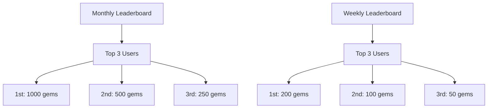

# LearnWay Project Documentation

## Table of Contents

1. [Project Overview](#project-overview)
2. [Architecture](#architecture)
3. [Smart Contracts](#smart-contracts)
4. [Contract Interactions](#contract-interactions)
5. [User Journey](#user-journey)
6. [API Reference](#api-reference)
7. [Deployment Guide](#deployment-guide)
8. [Security Considerations](#security-considerations)

## Project Overview

LearnWay is a blockchain-based educational platform that gamifies learning through a comprehensive reward system. The platform utilizes smart contracts to manage user progression, achievements, and rewards in a transparent and decentralized manner.

### Key Features

- **Gamified Learning**: Users earn XP, Gems, and Badges for completing educational activities
- **Quiz System**: Dynamic scoring system with rewards based on performance
- **Contest & Battle System**: Competitive learning experiences
- **Leaderboards**: Monthly and weekly rankings with rewards
- **NFT Badges**: Dynamic on-chain achievement tokens
- **Referral System**: Incentivizes user acquisition
- **Role-based Access Control**: Secure admin and manager permissions

### Core Tokens & Rewards

- **Gems**: In-app currency (non-transferable ERC-20 style)
- **XP (Experience Points)**: Ranking and progression system
- **Badges**: NFT achievements with dynamic attributes

---

## Architecture

```
┌─────────────────────────────────────────────────────────────┐
│                    LearnWay Platform                        │
└─────────────────────────────────────────────────────────────┘
                                │
                                ▼
┌─────────────────────────────────────────────────────────────┐
│                  LearnWayManager                            │
│           (Central Orchestration Layer)                     │
└─────────────────────────────────────────────────────────────┘
                                │
        ┌───────────────────────┼───────────────────────┐
        ▼                       ▼                       ▼
┌─────────────┐       ┌─────────────┐         ┌─────────────┐
│ GemsContract│       │ XPContract  │         │LearnWayBadge│
│             │       │             │         │    (NFT)    │
│ • Rewards   │       │ • Rankings  │         │ • Dynamic   │
│ • Spending  │       │ • XP Track  │         │   Metadata  │
│ • Referrals │       │ • Contests  │         │ • 24 Types  │
└─────────────┘       └─────────────┘         └─────────────┘
        │                       │                       │
        └───────────────────────┼───────────────────────┘
                                ▼
┌─────────────────────────────────────────────────────────────┐
│                 LearnWayAdmin                               │
│              (Access Control Hub)                          │
│                                                            │
│ • ADMIN_ROLE     • MANAGER_ROLE    • MODERATOR_ROLE       │
│ • EMERGENCY_ROLE • PAUSER_ROLE                            │
└─────────────────────────────────────────────────────────────┘
```

### Contract Relationship Flow

```
User Action (Quiz/Contest/Battle)
        │
        ▼
LearnWayManager ──────────────────────┐
        │                             │
        ├─── registerUser() ──────────┼─── GemsContract
        │                             │    ├─ Award signup bonus
        ├─── completeQuiz() ──────────┼─── │  ├─ Award quiz gems
        │                             │    │  └─ Referral rewards
        ├─── completeContest() ───────┼─── │
        │                             │    │
        └─── completeBattle() ────────┼─── │
                                      │    │
                ┌─────────────────────┼────┘
                │                     │
                ▼                     ▼
        XPContract              LearnWayBadge
        ├─ Award/Deduct XP      ├─ Update user stats
        ├─ Update leaderboard   ├─ Check badge eligibility
        └─ Track performance    └─ Mint/upgrade badges
                │                     │
                └─────────────────────┼─────────────┐
                                      │             │
                ┌─────────────────────┘             │
                │                                   │
                ▼                                   ▼
        Admin Authorization           Dynamic NFT Metadata
        (LearnWayAdmin)               (On-chain JSON)
```

---

## Smart Contracts

### 1. LearnWayAdmin

**Purpose**: Central access control and role management

**Key Features**:

- Role-based permissions (ADMIN, MANAGER, MODERATOR, etc.)
- Upgradeable via UUPS proxy pattern
- Emergency pause functionality
- Cross-contract authorization checks

**Roles**:

- `ADMIN_ROLE`: Full system control
- `MANAGER_ROLE`: Day-to-day operations
- `MODERATOR_ROLE`: Content moderation
- `EMERGENCY_ROLE`: Emergency functions
- `PAUSER_ROLE`: Pause contract functions

### 2. GemsContract

**Purpose**: In-app currency and reward management

**Key Features**:

- Non-transferable token system
- Dynamic quiz rewards: `(score - 70) * 2` for scores ≥ 70%
- Referral system with bonuses
- Monthly/weekly leaderboard rewards
- Anti-spam protection and rate limiting
- Upgradeable with security monitoring

**Reward Constants**:

```solidity
NEW_USER_SIGNUP_BONUS = 500 gems
REFERRAL_SIGNUP_BONUS = 50 gems
REFERRAL_BONUS = 100 gems
MIN_QUIZ_SCORE = 70%
```

### 3. XPContract

**Purpose**: Experience points and leaderboard management

**Key Features**:

- Real-time leaderboard updates
- XP rewards/penalties for quiz answers
- Contest and battle XP tracking
- Efficient leaderboard sorting algorithm
- Detailed user statistics

**XP Configuration**:

```solidity
correctAnswerXP = 4 XP
incorrectAnswerXP = -2 XP
contestParticipationXP = 25 XP
battleWinXP = 50 XP
battleLossXP = -10 XP
```

### 4. LearnWayBadge (NFT)

**Purpose**: Dynamic achievement badges as NFTs

**Key Features**:

- 24 different badge types across 6 categories
- Dynamic on-chain metadata
- Tier system (Bronze, Silver, Gold, Platinum, Diamond)
- Progress tracking for dynamic badges
- ERC-721 compliant with custom metadata
- KYC-gated Early Bird badge (limited to 1000 KYC users)

**Badge Categories**:

1. **ONBOARDING**: Keyholder, First Spark, Early Bird (KYC + first 1000)
2. **QUIZ_COMPLETION**: Quiz Explorer, Master of Levels, Quiz Titan, etc.
3. **STREAKS_CONSISTENCY**: Daily Claims, Routine Master, Quiz Devotee
4. **BATTLES_CONTESTS**: Duel Champion, Squad Slayer, Crown Holder
5. **SKILL_MASTERY**: Rising Star, DeFi Voyager, Savings Champion
6. **COMMUNITY_SHARING**: Community Connector, Echo Spreader, Event Star
7. **ULTIMATE**: Grandmaster, Hall of Famer (Limited supply)

### 5. LearnWayManager

**Purpose**: Central orchestration and user journey management

**Key Features**:

- Unified user registration across all contracts
- Quiz, contest, and battle completion workflows
- Achievement system with custom rewards
- User profile management
- Monthly reward distribution
- Cross-contract state synchronization

---

## Contract Interactions

### User Registration Flow

```
1. Frontend calls LearnWayManager.registerUser()
   │
   ├─── GemsContract.registerUser()
   │    ├─ Award 500 gems signup bonus
   │    └─ Process referral rewards if applicable
   │
   ├─── XPContract.registerUser()
   │    ├─ Initialize user stats
   │    └─ Add to leaderboard
   │
   ├─── LearnWayBadge.registerUser()
   │    ├─ Award "Keyholder" badge (Gold if KYC, Silver if not)
   │    └─ Award "Early Bird" badge ONLY if (KYC verified AND < 1000 KYC users)
   │
   └─── Create user profile in LearnWayManager
```

### Quiz Completion Flow

```
1. LearnWayManager.completeQuiz(user, score, answers[])
   │
   ├─── GemsContract.awardQuizGems(user, score)
   │    └─ Award: (score - 70) * 2 gems if score ≥ 70%
   │
   ├─── XPContract.recordQuizAnswer() for each answer
   │    ├─ +4 XP for correct, -2 XP for incorrect
   │    └─ Update leaderboard position
   │
   ├─── LearnWayBadge.updateUserStats()
   │    ├─ Increment quiz count
   │    ├─ Update correct answers
   │    └─ Check for badge upgrades
   │
   └─── Update user profile activity
```

### Badge Progression Example

```
Quiz Explorer Badge (Dynamic):
┌─ 100 quizzes ─ Bronze Tier
├─ 500 quizzes ─ Silver Tier
└─ 1000 quizzes ─ Gold Tier

Daily Claims Badge (Dynamic):
┌─ 30 day streak ─ Bronze Tier
├─ 90 day streak ─ Silver Tier
├─ 180 day streak ─ Gold Tier
└─ 365 day streak ─ Diamond Tier
```

---

## User Journey

### 1. Registration

```mermaid
graph TD
    A[User Registers] --> B[LearnWayManager.registerUser()]
    B --> C[GemsContract: 500 gems]
    B --> D[XPContract: 0 XP, Rank]
    B --> E[BadgeContract: Keyholder Badge]
    B --> F[Profile Created]

    E --> G{Early Bird?}
    G -->|Yes < 1000| H[Early Bird Badge]
    G -->|No| I[Continue]
```

### 2. Learning Activities

```mermaid
graph TD
    A[Complete Quiz] --> B[Score ≥ 70%?]
    B -->|Yes| C[Award Gems: (score-70)*2]
    B -->|No| D[No Gems]

    C --> E[Process XP per Answer]
    D --> E
    E --> F[Update Badges]
    F --> G[Check Achievements]

    H[Contest/Battle] --> I[Award Custom Rewards]
    I --> J[Update Stats & Badges]
```

### 3. KYC Update Flow

```mermaid
graph TD
    A[User Completes KYC] --> B[Admin calls updateKycStatus()]
    B --> C{User already registered?}
    C -->|No| D[Error: User not registered]
    C -->|Yes| E{Was previously KYC verified?}

    E -->|No| F[Update KYC status to true]
    F --> G[Upgrade Keyholder: Silver → Gold]
    G --> H{Within first 1000 KYC users?}
    H -->|Yes| I[Award Early Bird Badge]
    H -->|No| J[Early Bird spots exhausted]

    E -->|Yes| K[No badge changes needed]

    I --> L[Emit KYCStatusUpdated event]
    J --> L
    K --> L
```

### 4. Reward Distribution




---

## API Reference

### LearnWayManager Functions

#### User Management

```solidity
function registerUser(
    address user,
    address referralCode,
    string memory username,
    bool kycStatus
) external
```

#### Learning Activities

```solidity
function completeQuiz(
    address user,
    uint256 score,
    bool[] memory correctAnswers
) external

function completeContest(
    address user,
    string memory contestId,
    uint256 gemsEarned,
    uint256 xpEarned,
    bool isWin
) external

function completeBattle(
    address user,
    string memory battleType,
    bool isWin,
    uint256 gemsEarned,
    uint256 customXP
) external
```

#### Data Retrieval

```solidity
function getUserData(address user) external view returns (
    UserProfile memory profile,
    uint256 gemsBalance,
    uint256 xpBalance,
    uint256 userRank,
    uint256[] memory badgesList,
    uint256 totalBadgesEarned
)
```

### GemsContract Functions

#### Core Functions

```solidity
function balanceOf(address user) external view returns (uint256)
function spendGems(address user, uint256 amount, string memory reason) external
function awardContestGems(address user, uint256 amount, string memory contestType) external
```

### XPContract Functions

#### Core Functions

```solidity
function getXP(address user) external view returns (uint256)
function getUserRank(address user) external view returns (uint256)
function getTopUsers(uint256 count) external view returns (LeaderboardEntry[] memory)
```

### LearnWayBadge Functions

#### Badge Management

```solidity
function getUserBadges(address user) external view returns (uint256[] memory)
function getTokenAttributes(uint256 tokenId) external view returns (BadgeAttributes memory)
function userHasBadge(address user, uint256 badgeId) external view returns (bool)

// KYC and Early Bird Management
function updateKycStatus(address user, bool kycStatus) external
function canReceiveEarlyBird(address user) external view returns (bool canReceive, string memory reason)
function getEarlyBirdStats() external view returns (uint256 totalKycEarlyBirds, uint256 remainingKycSpots, uint256 maxSpots)
```

---

## Deployment Guide

### Prerequisites

- Solidity ^0.8.19
- OpenZeppelin Contracts (Upgradeable)
- Hardhat/Foundry development environment
- Node.js and npm/yarn

### Deployment Order

```bash
1. Deploy LearnWayAdmin (with proxy)
   npx hardhat run scripts/deploy-admin.js

2. Deploy GemsContract (with admin address)
   npx hardhat run scripts/deploy-gems.js

3. Deploy XPContract (with admin address)
   npx hardhat run scripts/deploy-xp.js

4. Deploy LearnWayBadge (with admin address)
   npx hardhat run scripts/deploy-badges.js

5. Deploy LearnWayManager (with admin address)
   npx hardhat run scripts/deploy-manager.js

6. Configure contract addresses in LearnWayManager
   manager.setContracts(gems, xp, badges)

7. Grant necessary roles in LearnWayAdmin
   admin.grantRole(MANAGER_ROLE, managerAddress)
```

### Environment Variables

```env
PRIVATE_KEY=your_private_key
INFURA_API_KEY=your_infura_key
ETHERSCAN_API_KEY=your_etherscan_key
ADMIN_ADDRESS=initial_admin_address
```

### Contract Verification

```bash
npx hardhat verify --network mainnet CONTRACT_ADDRESS "CONSTRUCTOR_ARGS"
```

---

## Security Considerations

### Access Control

- **Role-based permissions** through LearnWayAdmin
- **Multi-sig recommended** for admin functions in production
- **Least privilege principle** applied to role assignments

### Smart Contract Security

- **ReentrancyGuard** on all state-changing functions
- **Pausable** contracts for emergency stops
- **Input validation** on all parameters
- **Rate limiting** in GemsContract to prevent spam

### Upgrade Safety

- **UUPS proxy pattern** for upgradeability
- **Storage layout preservation** in upgrades
- **Admin-only upgrade authorization**

### Anti-Spam Measures

```solidity
// GemsContract rate limiting
MAX_TRANSACTIONS_PER_HOUR = 50
MAX_BATCH_SIZE = 100
COOLDOWN_PERIOD = 1 minute
```

### Blacklist Management

- Admin can blacklist malicious addresses
- Batch blacklist operations for efficiency
- Security alerts emitted for monitoring

### Data Integrity

- **Immutable badge metadata** stored on-chain
- **Event logging** for all major operations
- **Duplicate prevention** mechanisms

---

## Monitoring & Events

### Key Events to Monitor

```solidity
// User Activities
event UserRegistered(address indexed user, address indexed referrer, uint256 timestamp)
event QuizCompleted(address indexed user, uint256 score, uint256 gemsEarned, uint256 xpChange)
event BadgeEarned(address indexed user, uint256 indexed badgeId, uint256 tokenId, BadgeTier tier)

// Security Events
event SecurityAlert(address indexed user, string alertType, uint256 timestamp)
event RateLimitExceeded(address indexed user, string action, uint256 attemptCount)

// Administrative Events
event MonthlyRewardsDistributed(uint256 month, uint256 year, address[] topUsers, uint256[] rewards)
```

### Recommended Monitoring Setup

1. **Subgraph** deployment for efficient querying
2. **Event indexing** service (e.g., The Graph)
3. **Real-time alerts** for security events
4. **Dashboard** for admin operations

---

## Future Enhancements

### Potential Upgrades

- **Cross-chain compatibility** via bridge contracts
- **DeFi integration** for yield farming rewards
- **Governance token** for community voting
- **Marketplace** for badge trading
- **Staking mechanisms** for additional rewards

### Scalability Solutions

- **Layer 2 deployment** (Polygon, Arbitrum)
- **Batch operations** optimization
- **State compression** techniques
- **Off-chain computation** with on-chain verification

---

## Conclusion

LearnWay represents a comprehensive gamified learning platform built on blockchain technology. The modular architecture allows for flexibility and upgrades while maintaining security and user experience. The integration of multiple reward systems (Gems, XP, Badges) creates engaging user journeys that incentivize continuous learning and platform engagement.

For technical support or contributions, please refer to the project repository and follow the established development guidelines.
